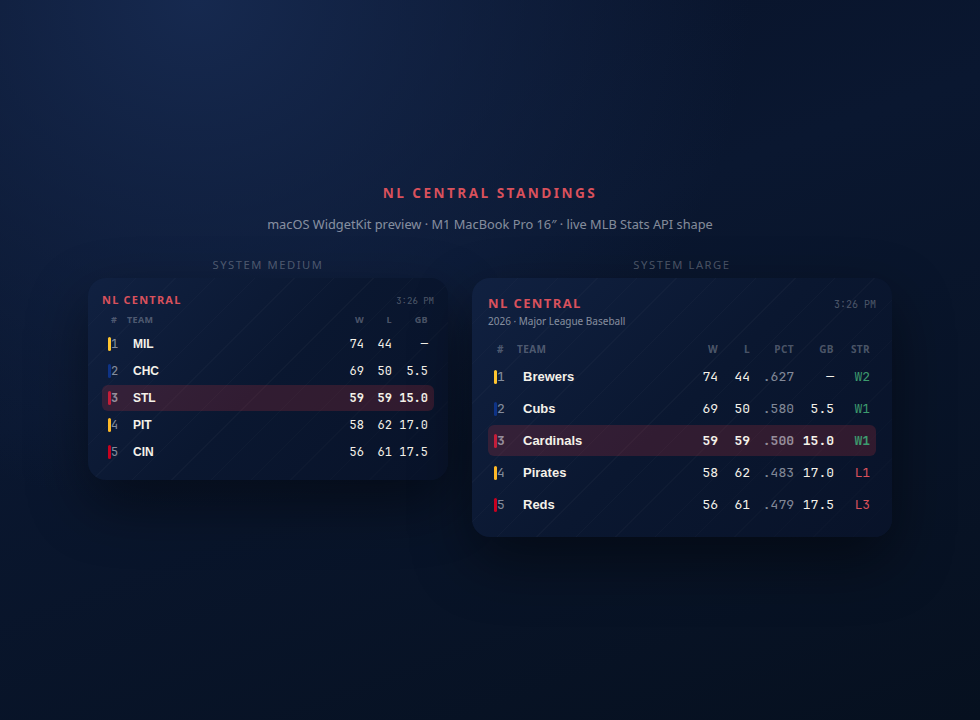

# NL Central Standings — macOS Widget

Native **WidgetKit** desktop widget for the National League Central, built for an **Apple Silicon M1 MacBook Pro 16"** (macOS 14 Sonoma or later).

Live data comes from the same MLB Stats API CommandCenter uses (`statsapi.mlb.com`). The Cardinals row is highlighted to match your sports favorites.

## What’s included

| Piece | Role |
| --- | --- |
| `NLCentralStandings` | Small host app (required by WidgetKit) — also shows the table |
| `NLCentralWidgetExtension` | Medium / Large / Extra Large desktop widgets |
| `Shared/` | Models, MLB client, Fenway scoreboard theme |

**Sizes**

- **Medium** — rank, abbreviation, W, L, GB  
- **Large / Extra Large** — adds PCT + streak; best on a 16" desktop  

Refreshes about every 30 minutes (WidgetKit may batch updates).



## Install on your M1 MacBook Pro

1. Open `NLCentralStandings.xcodeproj` in **Xcode 15+** on the Mac.
2. Select the **NLCentralStandings** scheme and your Mac as the run destination (`My Mac (Designed for iPad)` is wrong — use **My Mac**).
3. Signing: select your **Personal Team** on both the app and `NLCentralWidgetExtension` targets (Signing & Capabilities). Bundle IDs are `com.commandcenter.nlcentral` / `.widget`.
4. Press **⌘R** once. Leave the host app running (or quit after first launch — the widget stays registered).
5. Add the widget:
   - Right-click the desktop → **Edit Widgets**, or
   - Notification Center → **Edit Widgets**
   - Search **NL Central** → drag **Medium** or **Large** onto the desktop.

### Build from the terminal (optional)

```bash
cd NLCentralStandings
xcodebuild -scheme NLCentralStandings -destination 'platform=macOS,arch=arm64' -configuration Debug build
```

Then open the built app under DerivedData (or use Xcode’s Run).

## Design

Uses CommandCenter’s Fenway scoreboard palette (navy field, cream type, Cardinals red accent). Each club gets a thin franchise color bar; STL is bold + tinted.

## Notes

- **macOS 14+** required for desktop widgets.
- **arm64 only** — tuned for M1 (no Intel slice).
- Network client entitlement is enabled for both targets so sandboxed builds can hit MLB.
- Offline: last successful fetch is cached under Application Support.
- MLB data is unofficial / for personal use; subject to [MLB copyright notice](http://gdx.mlb.com/components/copyright.txt).
